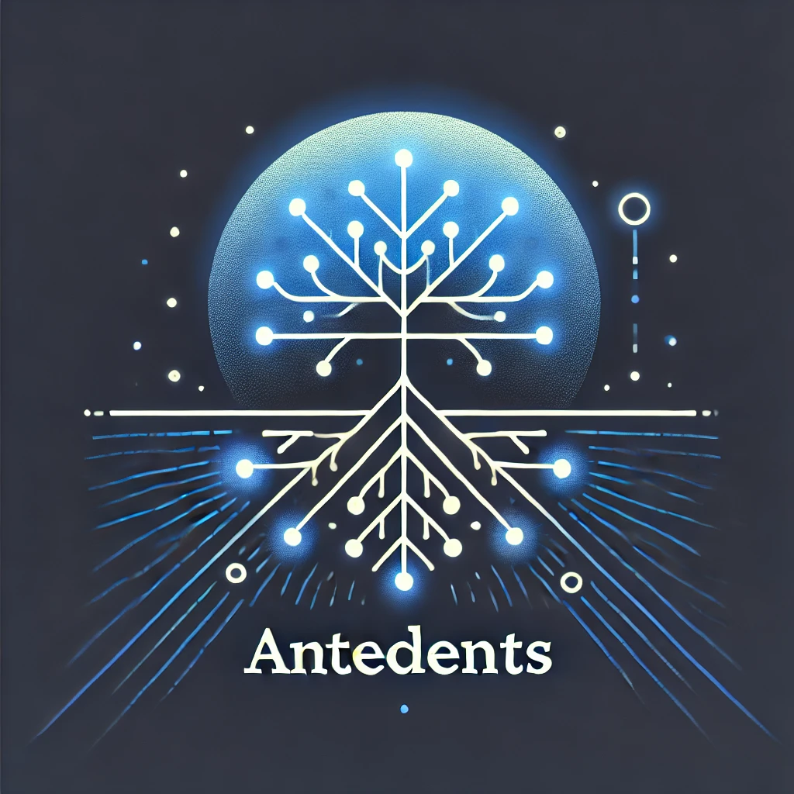
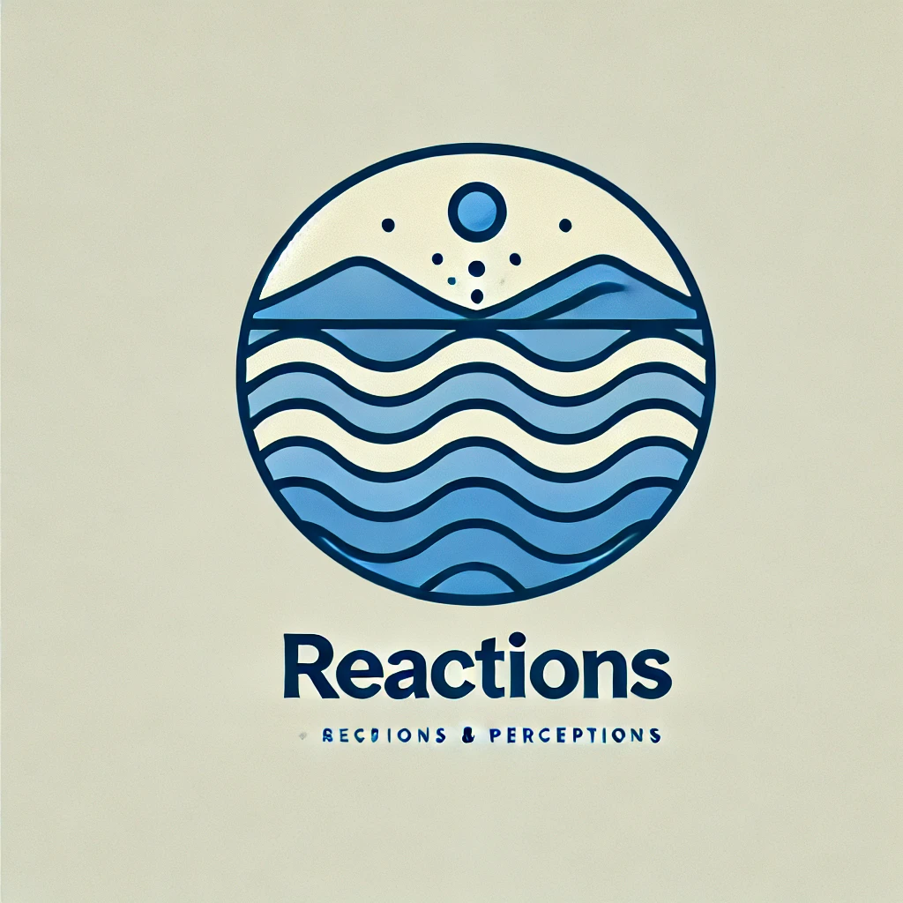

# Research Topics

All Organization Science research is categorized into topic areas that collectively span the field of organizational behavior.

## Featured Topics

<section class="featured-topics">
  

    
    

      <h2>Antecedents</h2>
      <ul>
        <li><a href="/topics/antecedents.html#brady2024">Brady & Sivanathan (2024): Leader Dominance</a></li>
        <li><a href="/topics/antecedents.html#chambers2024">Chambers (2024): Nonmonetary Reward Systems</a></li>
        <li><a href="/topics/antecedents.html#dakhlallah2024">Dakhlallah (2024): Transparency and Bribery</a></li>
      </ul>
      <a href="/topics/antecedents.html" class="more-link">More research on this topic →</a>
    

  

  

    
    

      <h2>Consequences</h2>
      <ul>
        <li><a href="/topics/consequences.html#dimitriadis2024">Dimitriadis (2024): Boko Haram Insurgency</a></li>
        <li><a href="/topics/consequences.html#distelhorst2022">Distelhorst & McGahan (2022): Emerging Market Employment</a></li>
      </ul>
      <a href="/topics/consequences.html" class="more-link">More research on this topic →</a>
    

  

  

    
    

      <h2>Reactions</h2>
      <ul>
        <li><a href="/topics/reactions.html#berry2024">Berry & Hildreth (2024): Loyalty in Moral Dilemmas</a></li>
        <li><a href="/topics/reactions.html#keum2024">Keum & Meier (2024): Layoffs and Unemployment Insurance</a></li>
      </ul>
      <a href="/topics/reactions.html" class="more-link">More research on this topic →</a>
    

  

</section>
